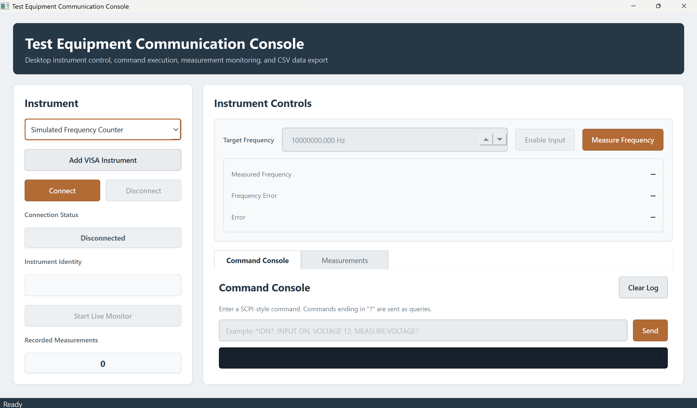
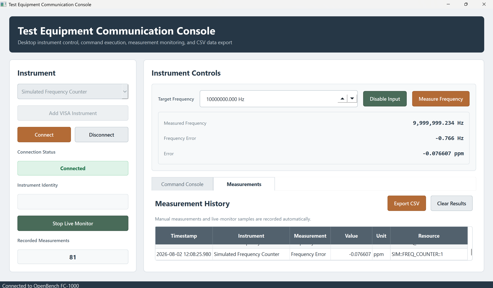
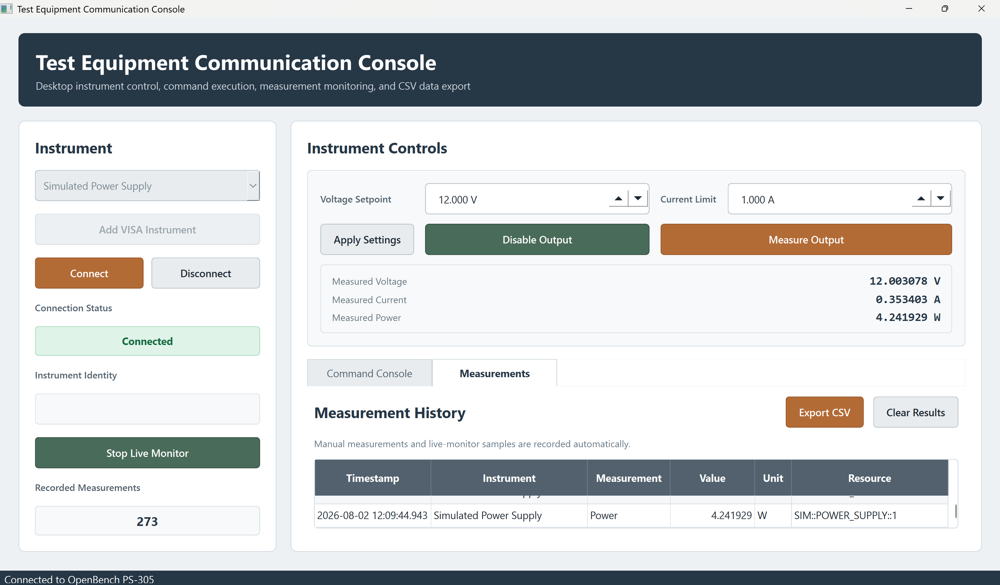
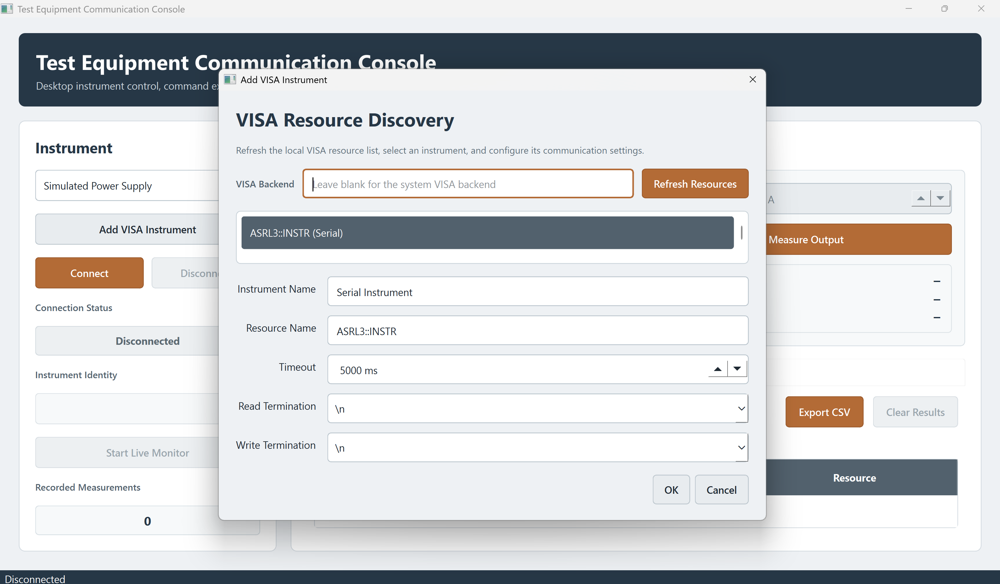

# Test Equipment Communication Console

A desktop application for communicating with simulated and real electronic test equipment.

The application provides a structured instrument-driver architecture, a PySide6 desktop interface, a SCPI-style command console, live measurement monitoring, CSV data export, PyVISA resource discovery, and automated tests.


## Overview

The Test Equipment Communication Console demonstrates how production-test software can support both simulated hardware and physical instruments through a common driver interface.

The built-in simulators allow the application to be demonstrated and tested without laboratory hardware. Real instruments can be discovered and opened through PyVISA when a compatible VISA implementation and instrument connection are available.

## Features

- PySide6 desktop interface
- Abstract instrument-driver architecture
- Simulated frequency counter
- Simulated programmable DC power supply
- Generic PyVISA instrument driver
- VISA resource discovery
- GPIB, USB, serial, TCP/IP, PXI, and VXI resource classification
- SCPI-style command console
- Instrument identity display
- Instrument-specific control panels
- Live measurement monitoring
- Frequency-error calculations in hertz and parts per million
- Voltage, current, and power measurements
- Timestamped measurement history
- CSV data export
- Windows standalone executable build
- Automated unit tests using simulated and fake VISA resources

## Screenshots

### Main Interface



### Simulated Frequency Counter



### Simulated Power Supply



### VISA Resource Discovery



## Application Modes

### Simulation Mode

Simulation mode requires no external equipment.

The application includes:

- OpenBench FC-1000 simulated frequency counter
- OpenBench PS-305 simulated programmable power supply

These simulators support connection state, command processing, measurement noise, forced test values, reset behavior, output state, current limiting, and SCPI-style queries.

### VISA Mode

VISA mode supports real laboratory instruments through PyVISA.

The application can discover resources exposed by the installed VISA implementation, including:

- GPIB
- USB
- Serial
- TCP/IP
- PXI
- VXI

A discovered resource can be added to the instrument list and controlled through the generic command console.

Real-instrument communication requires:

- A compatible VISA implementation
- The appropriate hardware interface and driver
- A connected instrument
- Correct communication settings
- Commands supported by the selected instrument

## Project Structure

```text
test-equipment-console/
├── src/
│   └── test_equipment_console/
│       ├── app.py
│       ├── measurements.py
│       ├── drivers/
│       │   ├── base.py
│       │   ├── discovery.py
│       │   └── visa.py
│       ├── simulators/
│       │   ├── frequency_counter.py
│       │   └── power_supply.py
│       └── ui/
│           ├── main_window.py
│           └── visa_dialog.py
├── tests/
│   ├── test_discovery.py
│   ├── test_drivers.py
│   ├── test_measurements.py
│   ├── test_simulators.py
│   └── test_visa_driver.py
├── docs/
│   └── screenshots/
│       ├── main-interface.png
│       ├── frequency-counter.png
│       ├── power-supply.png
│       └── visa-discovery.png
├── build_windows.bat
├── pyproject.toml
├── run.py
├── LICENSE
└── README.md
```

## Architecture

The application separates instrument communication from the user interface.

```text
PySide6 User Interface
        │
        ▼
BaseInstrument Interface
        │
        ├── SimulatedFrequencyCounter
        ├── SimulatedPowerSupply
        └── VisaInstrument
                 │
                 ▼
              PyVISA
                 │
                 ▼
         Physical Test Equipment
```

The `BaseInstrument` abstraction defines the common lifecycle and communication interface:

- Connect
- Disconnect
- Identify
- Write
- Query
- Connection-state tracking
- Error handling

The simulator and VISA implementations use the same interface, allowing the desktop application to switch between simulated and physical equipment without changing the command-console workflow.

## Requirements

- Windows, Linux, or macOS
- Python 3.12 or newer
- PySide6
- PyVISA
- pytest for development and testing

Python 3.14 has also been used successfully during development.

## Installation

Clone the repository:

```powershell
git clone https://github.com/JustinGottliebEngineering/test-equipment-console.git
cd test-equipment-console
```

Create a virtual environment:

```powershell
python -m venv .venv
```

Activate it in PowerShell:

```powershell
.\.venv\Scripts\Activate.ps1
```

Install the application and development dependencies:

```powershell
python -m pip install --upgrade pip
python -m pip install -e ".[dev]"
```

## Running the Application

From the project root with the virtual environment active:

```powershell
python run.py
```

The installed console entry point can also be used:

```powershell
test-equipment-console
```

## Simulated Frequency Counter

Select `Simulated Frequency Counter`, then:

1. Click **Connect**.
2. Click **Enable Input**.
3. Enter the target frequency.
4. Click **Measure Frequency**.
5. Optionally start the live monitor.

Supported example commands:

```text
*IDN?
INPUT ON
INPUT OFF
INPUT?
MEASURE:FREQUENCY?
*RST
```

The application displays:

- Measured frequency
- Frequency error in hertz
- Frequency error in parts per million

## Simulated Power Supply

Select `Simulated Power Supply`, then:

1. Click **Connect**.
2. Set voltage and current limit.
3. Click **Apply Settings**.
4. Click **Enable Output**.
5. Click **Measure Output**.
6. Optionally start the live monitor.

Supported example commands:

```text
*IDN?
VOLTAGE 12
VOLTAGE?
CURRENT 1
CURRENT?
OUTPUT ON
OUTPUT OFF
OUTPUT?
MEASURE:VOLTAGE?
MEASURE:CURRENT?
MEASURE:POWER?
*RST
```

The simulator models:

- Voltage setpoint
- Current limit
- Resistive load
- Constant-voltage operation
- Current-limited operation
- Measurement noise
- Output enable and disable state

## Command Console

The command console accepts one command at a time.

Commands ending in `?` are sent as queries:

```text
*IDN?
```

Commands without `?` are sent as write operations:

```text
OUTPUT ON
```

The log records:

- Timestamp
- Transmitted command
- Received response
- System messages
- Communication errors

## Measurement History

Manual measurements and live-monitor samples are stored in the measurement-history table.

Each record includes:

- Timestamp
- Instrument
- Measurement type
- Value
- Unit
- Resource name

Frequency-counter measurements create records for:

- Frequency
- Frequency error in hertz
- Frequency error in parts per million

Power-supply measurements create records for:

- Voltage
- Current
- Power

## CSV Export

Open the **Measurements** tab and click **Export CSV**.

The exported file contains these columns:

```text
timestamp
instrument
resource
measurement_type
value
unit
```

Files are written using UTF-8 with a byte-order mark for compatibility with spreadsheet applications.

## VISA Resource Discovery

Click **Add VISA Instrument** to open the VISA discovery dialog.

The dialog allows the user to:

- Refresh available VISA resources
- Select a discovered resource
- Manually enter a resource name
- Name the instrument
- Configure timeout
- Configure read termination
- Configure write termination
- Specify an alternate PyVISA backend

A resource may appear even when it is not laboratory test equipment. For example, serial ports may be exposed as `ASRL` resources. Verify the connected device before opening it.

## Running Tests

Run the complete test suite:

```powershell
python -m pytest -v
```

The test suite covers:

- Base-driver state transitions
- Connection errors
- Command validation
- Simulator measurements
- Frequency-error calculations
- Power-supply current limiting
- Measurement records
- CSV row formatting
- VISA connection behavior
- VISA read and write failures
- VISA resource discovery
- Interface classification
- Resource cleanup

The VISA tests use fake resource managers and fake instruments, so physical test equipment is not required.

## Test Coverage

Run tests with coverage:

```powershell
python -m pytest --cov=test_equipment_console --cov-report=term-missing
```

## Windows Executable

Build a standalone Windows executable with:

```powershell
.\build_windows.bat
```

The build script:

1. Verifies the virtual environment.
2. Installs or updates PyInstaller.
3. Runs the complete test suite.
4. Removes previous build output.
5. Packages PySide6 and PyVISA dependencies.
6. Creates a standalone executable.

The output is:

```text
dist\TestEquipmentConsole.exe
```

Run it with:

```powershell
.\dist\TestEquipmentConsole.exe
```

Do not run the batch file with Python.

Incorrect:

```powershell
python build_windows.bat
```

Correct:

```powershell
.\build_windows.bat
```

## Example VISA Resources

Common VISA resource formats include:

```text
GPIB0::13::INSTR
USB0::0x1234::0x5678::SERIAL::INSTR
TCPIP0::192.168.1.50::INSTR
ASRL3::INSTR
```

The exact format depends on the instrument, interface, driver, and VISA implementation.

## Engineering Use Cases

This architecture can be extended for:

- Automated production testing
- Instrument qualification
- Calibration utilities
- Environmental monitoring
- Design-verification testing
- Manufacturing test stations
- Engineering laboratory tools
- Test-data collection
- Equipment troubleshooting

## Future Enhancements

Potential future work includes:

- Dedicated real-instrument drivers
- Asynchronous communication workers
- Communication retries
- Configurable polling intervals
- SQLite measurement persistence
- Plotted measurement trends
- Command profiles
- Automated test sequences
- Pass/fail limits
- JSON test definitions
- Instrument configuration files
- Packaged application installer

## License

This project is licensed under the MIT License.

## Author

Justin Gottlieb  
Test Engineering and Manufacturing Software
